# Process Function Flowchart

This flowchart shows exactly what happens when the `Process()` function is called in the Timer class. **Note: This function only executes in DEBUG mode - in release builds, it will do nothing.**

```mermaid
flowchart TD
    A[Start: Process Function Called] --> B{DEBUG Mode?}
    B -->|No| C[Do Nothing<br/>Return Task.CompletedTask]
    B -->|Yes| D[Initialize contracts Dictionary<br/>Key: email, Value: HashSet of date ranges]
    
    D --> E[Call linkSafe.GetWorkers]
    
    E --> F{API Response<br/>Content Available?}
    F -->|No| G[Return Empty Array]
    F -->|Yes| H[Deserialize to WorkersModel]
    
    H --> I{Workers Array<br/>Empty or Null?}
    I -->|Yes| J[Read workers.json file<br/>as fallback]
    I -->|No| K[Process Workers Array]
    J --> K
    
    K --> L[For Each Worker in Array]
    L --> M{Worker Email<br/>Exists in contracts?}
    M -->|No| N[Create new HashSet<br/>for this email]
    M -->|Yes| O[Get existing HashSet]
    N --> P[Add to contracts dictionary]
    O --> P
    
    P --> Q[For Each Induction in Worker]
    Q --> R[Add induction date range<br/>to HashSet:<br/>InductedOnUtc, ExpiresOnUtc]
    R --> S{More Inductions?}
    S -->|Yes| Q
    S -->|No| T{More Workers?}
    T -->|Yes| L
    T -->|No| U[For Each Contract in contracts]
    
    U --> V[Call kisis.SyncGroupLinks<br/>with email and date ranges]
    
    V --> W[Kisi Sync Process:<br/>Get existing group links]
    W --> X[Paginate through results<br/>250 per page]
    X --> Y[Filter links by:<br/>- Name prefix match<br/>- Email contains worker email]
    
    Y --> Z[Cleanup Phase:<br/>Remove outdated links]
    Z --> AA{Link name matches<br/>current date range?}
    AA -->|No| BB[Remove Group Link<br/>via API call]
    AA -->|Yes| CC[Keep existing link]
    BB --> CC
    CC --> DD{More existing links?}
    DD -->|Yes| AA
    DD -->|No| EE[Add New Links Phase]
    
    EE --> FF{Date range needs<br/>new group link?}
    FF -->|Yes| GG[Create new Group Link<br/>via API call]
    FF -->|No| HH[Link already exists]
    GG --> HH
    HH --> II{More date ranges?}
    II -->|Yes| FF
    II -->|No| JJ{More pages?}
    JJ -->|Yes| X
    JJ -->|No| KK{More contracts?}
    
    KK -->|Yes| U
    KK -->|No| LL[Process Complete]
    
    LL --> MM[Finally Block:<br/>Always execute]
    MM --> NN[Call errorService.Send]
    NN --> OO{Any errors logged?}
    OO -->|Yes| PP[Send error email<br/>via SMTP]
    OO -->|No| QQ[No email sent]
    PP --> RR[Clear error logs]
    QQ --> RR
    RR --> SS[End: Process Function Complete]
    
    %% Error handling paths
    TT[Exception Caught] --> UU[Log error to errorService<br/>AddErrorLog with exception details]
    UU --> MM
    
    %% Exception can occur at any point
    E -.-> TT
    V -.-> TT
    W -.-> TT
    BB -.-> TT
    GG -.-> TT
    
    %% Styling
    classDef startEnd fill:#e1f5fe
    classDef process fill:#f3e5f5
    classDef decision fill:#fff3e0
    classDef error fill:#ffebee
    classDef api fill:#e8f5e8
    classDef debug fill:#fff9c4
    
    class A,SS startEnd
    class D,E,H,J,K,L,N,P,Q,R,U,V,W,X,Y,Z,EE,FF,GG,HH,LL,MM,NN,PP,QQ,RR process
    class B,F,I,M,S,T,AA,DD,FF,II,JJ,KK,OO decision
    class TT,UU error
    class E,V,W,BB,GG,PP api
    class B,C debug
```

## Key Components Explained

### 1. Data Collection Phase
- **LinkSafe API Call**: Retrieves all workers and their induction records
- **Fallback Mechanism**: If API returns empty, reads from local `workers.json` file
- **Data Processing**: Groups workers by email and collects all valid date ranges from their inductions

### 2. Synchronization Phase
- **Kisi API Integration**: For each worker, synchronizes their access permissions
- **Pagination**: Handles large datasets by processing 250 records per page
- **Cleanup**: Removes outdated group links that no longer match current induction periods
- **Creation**: Creates new group links for current valid induction periods

### 3. Error Handling
- **Exception Catching**: Any unhandled exceptions are logged to the error service
- **Email Notifications**: All collected errors are sent via email in the finally block
- **Guaranteed Execution**: Error reporting happens regardless of success or failure

### 4. Data Flow
- **Input**: Workers with induction records from LinkSafe
- **Processing**: Group by email, extract date ranges, synchronize with Kisi
- **Output**: Updated group links in Kisi system matching current induction validity periods

## API Endpoints Used

### LinkSafe API
- `GET /2.0/Compliance/Workers/List` - Retrieves all workers and inductions

### Kisi API
- `GET /group_links` - Retrieves existing group links (paginated)
- `POST /group_links` - Creates new group links
- `DELETE /group_links/{id}` - Removes existing group links

## Configuration Dependencies
- **LinkSafeConfig**: API token for LinkSafe authentication
- **KisisConfig**: API token, group ID, and name prefix for Kisi integration
- **EmailConfig**: SMTP settings for error notifications
